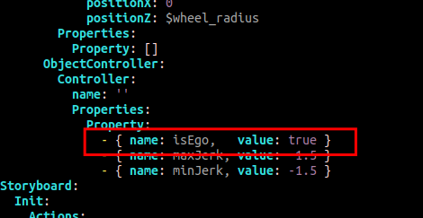
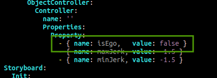
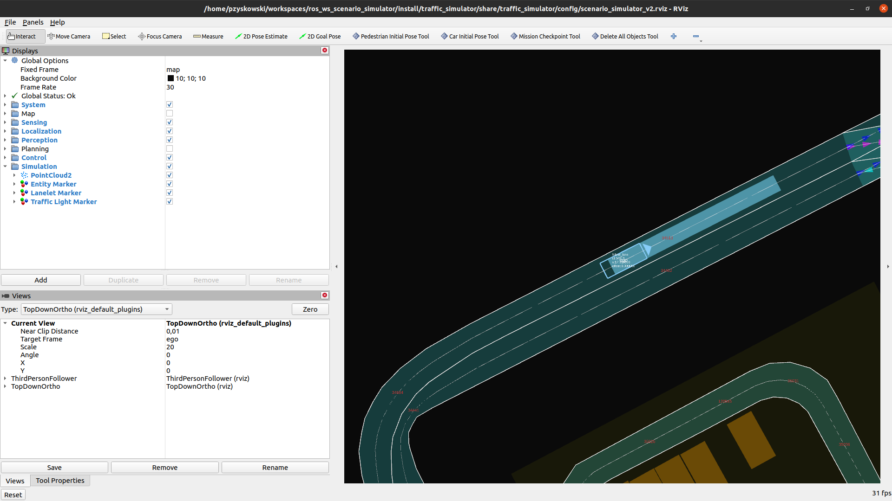

# Running `scenario_simulator_v2` without Autoware

This tutorial describes all steps necessary to run `scenario_simulator_v2` without Autoware.

## Prerequisites

This instruction assumes operating system: Ubuntu 20.04 LTS Desktop. It can be downloaded [here](https://ubuntu.com/download/desktop/thank-you?version=20.04.4&architecture=amd64)

## Cleaning old installations

### Cleaning ROS2 installation

Before building process, you might want to remove older ROS2 distribution.

Please note, however, that several ROS2 distributions can coexist within the system.

Preparing distribution to be used is done via `source` of desired distribution's setup script.
In case of ROS2 Galacic Geochelone:

```shell
source /opt/ros/galactic/setup.bash
```

However, removing unused distributions can keep filesystem cleaner. Therefore, to remove for example ROS 2 Foxy Fitzroy, call:

```shell
sudo apt remove ros-foxy-*
```

### Making sure environment is clean

Please make sure to remove any instances of ROS2 scripts `source` executions from `~/.bashrc` file.

If different distribution's setup script is sourced by default in `~/.bashrc`, it might interfere with the build process.

### Cleaning `scenario_simulator_v2` build

To clean the build, remove directories created during `colcon build` process

For example, in case of directory used during the installation, to clean `scenario_simulator_v2` build call:

```shell
rm -rf ~/scenario_simulator_ws/{install,build,log}
```

Any other workspace build can be cleaned analogously, if necessary.

### Removing unnecessary `scenario_simulator_v2` installations

If necessary, to clear old `scenario_simulator_v2` installations, remove their workspace entirely.

For example, in case of directory used during the installation, to remove `scenario_simulator_v2` call:
```shell
rm -rf ~/scenario_simulator_ws
```
Any other workspace directory can be removed analogously, if necessary.

## How to build

### Install and setup ROS2 environment

Instruction below is based on [official ROS2 instruction](https://docs.ros.org/en/galactic/Installation/Ubuntu-Install-Debians.html)

Check locale information
```
locale
```

It is important that output contains UTF-8 formatting. Might be similar to text below:
```
LANG=en_US.UTF-8
LANGUAGE=
LC_CTYPE="en_US.UTF-8"
LC_NUMERIC=pl_PL.UTF-8
LC_TIME=pl_PL.UTF-8
LC_COLLATE="en_US.UTF-8"
LC_MONETARY=pl_PL.UTF-8
LC_MESSAGES="en_US.UTF-8"
LC_PAPER=pl_PL.UTF-8
LC_NAME=pl_PL.UTF-8
LC_ADDRESS=pl_PL.UTF-8
LC_TELEPHONE=pl_PL.UTF-8
LC_MEASUREMENT=pl_PL.UTF-8
LC_IDENTIFICATION=pl_PL.UTF-8
LC_ALL=
```

If it's not execute:

```
sudo apt update && sudo apt install -y locales
sudo locale-gen en_US en_US.UTF-8
sudo update-locale LC_ALL=en_US.UTF-8 LANG=en_US.UTF-8
LANG=en_US.UTF-8
```

Verify setting again:
```
locale
```

Add ros repository for apt to use
```
sudo apt update && sudo apt install -y curl gnupg lsb-release
sudo curl -sSL https://raw.githubusercontent.com/ros/rosdistro/master/ros.key  -o /usr/share/keyrings/ros-archive-keyring.gpg
echo "deb [arch=$(dpkg --print-architecture) signed-by=/usr/share/keyrings/ros-archive-keyring.gpg] http://packages.ros.org/ros2/ubuntu $(lsb_release -cs) main" | sudo tee /etc/apt/sources.list.d/ros2.list > /dev/null
```

Update packages information and install ROS2 Galactic:
```
sudo apt update
sudo apt install -y ros-galactic-desktop
```

### Install and configure Cyclone DDS - can be done once

Install Cyclone DDS 

```shell
sudo apt install ros-galactic-rmw-cyclonedds-cpp
```

Set Cyclone DDS as default RMW implementation by adding the following line to `~/.bashrc`
```shell
export RMW_IMPLEMENTATION=rmw_cyclonedds_cpp
```

Create the following directory

```shell
sudo mkdir -p /opt/autoware
```

Create and insert the following content into created file (`cyclonedds_config.xml`) using command:

```
echo "<?xml version="1.0" encoding="UTF-8" ?>
<CycloneDDS xmlns="https://cdds.io/config" xmlns:xsi="http://www.w3.org/2001/XMLSchema-instance" xsi:schemaLocation="https://cdds.io/config https://raw.githubusercontent.com/eclipse-cyclonedds/cyclonedds/master/etc/cyclonedds.xsd">
    <Domain id="any">
        <General>
            <NetworkInterfaceAddress>logging_bond0</NetworkInterfaceAddress>
            <AllowMulticast>spdp</AllowMulticast>
            <MaxMessageSize>65500B</MaxMessageSize>
            <FragmentSize>4000B</FragmentSize>
        </General>
        <Internal>
            <MinimumSocketReceiveBufferSize>10MB</MinimumSocketReceiveBufferSize>
            <Watermarks>
                <WhcHigh>500kB</WhcHigh>
            </Watermarks>
        </Internal>
        <Tracing>
            <Verbosity>config</Verbosity>
            <OutputFile>/tmp/cyclonedds.log</OutputFile>
        </Tracing>
    </Domain>
</CycloneDDS>
" | sudo tee /opt/autoware/cyclonedds_config.xml > /dev/null
```

Add the following line to the `~/.bashrc` file

```shell
export CYCLONEDDS_URI=file:///opt/autoware/cyclonedds_config.xml
```

Then execute
```shell
source ~/.bashrc
```

### Configure network interfaces - HAS TO BE DONE ON EACH NEW TERMINAL 

Change maximum receive buffer size

```shell
sudo sysctl -w net.core.rmem_max=2147483647
```

Set localhost to support multicast 

```shell
sudo ifconfig lo multicast
```

### Get `scenario_simulator_v2`

Install git
```
sudo apt install -y git
```

Throughout this document we will use `~/scenario_simulator_ws` as an exemplary `scenario_simulator_v2` workspace
directory. However, it can be replaced with any other directory.

Create directory for a workspace and enter this directory.

```
mkdir -p ~/scenario_simulator_ws/src
cd ~/scenario_simulator_ws/src
```

Clone `scenario_simulator_v2` repository:

```
git clone https://github.com/tier4/scenario_simulator_v2.git
```

### Download dependencies

Install vcs tools
```
sudo apt install -y python3-vcstool
```

Download `scenario_simulator_v2` dependencies
```
vcs import scenario_simulator_v2/external < scenario_simulator_v2/dependency_galactic.repos
```

Get and initialize `rosdep` tool that enables downloading the system dependencies of `scenario_simulator_v2` packages
```
sudo apt install -y python3-pip
sudo pip install -U rosdep
sudo rosdep init
```

Update `rosdep` packages information and download `scenario_simulator_v2` dependencies
```
rosdep update
rosdep install -iry --from-paths . --rosdistro galactic
```

### Build `scenario_simulator_v2`

Install `colcon` build tool:
```
apt install -y python3-colcon-common-extensions
```

Move to workspace directory:
```
cd <workspace_directory>
```

Source ROS2 environment script:

```
source /opt/ros/galactic/setup.bash
```

Build workspace content
```
colcon build
```

This process should end with all packages built. Some packages might be reported to have `stderr output` - this is fine.
```
Summary: 47 packages finished [12min 48s]
  1 package had stderr output: simple_sensor_simulator
```

## How to run a sample scenario

This part of the instruction is based on scenario:
```
~/scenario_simulator_ws/src/scenario_simulator_v2/test_runner/scenario_test_runner/scenario/sample.yaml

```

### Map directory structure

Sample scenario specifies `map` directory in `kashiwanoha_map` package that contains map information of 
the University of Tokyo Kashiwa Campus test site.

```yaml
    filepath: $(ros2 pkg prefix --share kashiwanoha_map)/map
```

To run a scenario, `scenario_simulator_v2` expects two files to be present in this directory:

    - one point cloud file with `*.pcd` extension
    - one lanelet2 map file with `*.osm` extension


Please make sure that `~/scenario_simulator_ws/src/scenario_simulator_v2/map/kashiwanoha_map/map` contains, among others,
two required files. Other files present there are not used by `scenario_simulator_v2` during the scenario execution.
    
This requirement is true for any map path specified in the scenario file.

### Necessary scenario modification

Running scenarios with disabled Autoware requires minor scenario modification.

By default scenarios expect main vehicle to be spawned as Ego, meaning that it is controlled by Autoware software:



To run `scenario_simulator_v2` without Autoware `isEgo` value should be changed to `false`



### Scenario execution

To execute scenario, move to workspace directory and source workspace setup script

```
cd `<workspace_directory>`
source install/setup.bash
```

And execute:
```
ros2 launch scenario_test_runner scenario_test_runner.launch.py scenario:='src/scenario_simulator_v2/test_runner/scenario_test_runner/scenario/sample.yaml' launch_rviz:=true
```

Command above should run `rviz` visualization tool. Vehicle should be moving along the lane



### Troubleshooting


